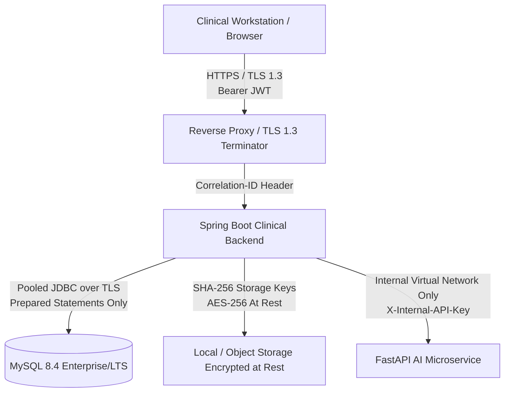

# BrainTwinX — Security Architecture & Threat Model

**Status:** APPROVED FOR IMPLEMENTATION  
**Classification:** Medical Device Decision Support (SaMD) Technical Security Specification  
**Review Standard:** OWASP Top 10, NIST SP 800-53, ISO 27001, STRIDE

---

## 1. Executive Summary

BrainTwinX provides AI-assisted clinical decision support for neuro-oncology imaging. Because the system processes clinical brain MRI scans, patient metadata, and generates inference telemetry, its security architecture is designed with **defense-in-depth**, **least privilege**, and **zero implicit trust**.

The architecture strictly segregates:
1. **Public/Clinical Clients** (Web browser / Mobile clients)
2. **Clinical Backend Service** (Spring Boot 4 / Java 21 LTS)
3. **Relational Persistence** (MySQL 8.4 LTS with hardware-enforced CHECK constraints)
4. **Internal AI Microservice** (FastAPI / PyTorch / CUDA worker pool)

---

## 2. Network Topology & Boundary Defense



### Boundary Enforcement
- **Internal AI Service Isolation:** The `ai-service` is deployed in a private network namespace or virtual network. It does not accept direct traffic from the public internet or clinical workstations.
- **Mutual API Key Authentication:** All communication between `backend` and `ai-service` requires a high-entropy `X-Internal-API-Key` configured via secure environment variables (`INTERNAL_API_KEY`).
- **TLS 1.3 Everywhere:** Public transit is encrypted exclusively with TLS 1.3 using forward-secret cipher suites.

---

## 3. STRIDE Threat Analysis & Implemented Countermeasures

| STRIDE Threat | Attack Vector | BrainTwinX Countermeasure & Proof |
|---|---|---|
| **Spoofing** | Forged clinician session or replay attack | Cryptographically signed HMAC-SHA256 JWTs with 15-minute expiration. Refresh tokens are single-use, rotating, and stored only as SHA-256 hashes in MySQL. |
| **Tampering** | Modification of scan bytes, masks, or audit records | Scans and masks are immutable once stored; content SHA-256 is validated before and after storage. Audit logs are append-only (`GRANT INSERT, SELECT ON audit_logs`). |
| **Repudiation** | Clinician denies uploading a scan or running analysis | Comprehensive transactional `audit_logs` table recording `user_id`, `username`, `remote_ip`, `user_agent`, `correlation_id`, `action`, and timestamp. |
| **Information Disclosure** | IDOR probing of patient records or model outputs | All entity URLs use opaque UUIDv4 identifiers. Doctors are strictly scoped to their assigned caseload (`isAssignedTo`). Out-of-scope access throws 404 (indistinguishable from non-existence). |
| **Denial of Service** | Decompression bombs or oversized MRI uploads | Strict upload validation: maximum file size cap (50 MB), magic-byte signature validation, and decompressed dimension caps ($2048 \times 2048$). |
| **Elevation of Privilege** | Researcher invoking write or diagnostic endpoints | Role-Based Access Control (`ADMIN`, `DOCTOR`, `RESEARCHER`) enforced at controller and service layers via Spring Security `@PreAuthorize` and programmatic guards. |

---

## 4. Insecure Direct Object Reference (IDOR) Defense Specification

A critical vulnerability in healthcare systems is horizontal privilege escalation where an authenticated doctor in Hospital A accesses patient records from Hospital B by modifying an ID.

BrainTwinX enforces **dual-layer IDOR protection**:

1. **Opaque Public Identifiers:**
   - Sequential database primary keys (`BIGINT AUTO_INCREMENT`) are never exposed in REST endpoints, JSON responses, or error messages.
   - All client-visible identifiers use randomly generated UUIDv4 strings (`publicId`).
2. **Caseload Authorization Precondition:**
   - Every patient- or scan-centric service operation resolves the authenticated `caller` from the JWT principal.
   - For users with the `DOCTOR` role, the system asserts:
     ```java
     if (caller.isDoctor() && !patient.getCreatedBy().getId().equals(caller.getId())) {
         log.warn("User {} attempted out-of-scope access to patient {}", caller.getUsername(), patientCode);
         throw ResourceNotFoundException.patient(patientCode);
     }
     ```
   - **Crucial Security Behavior:** The system throws HTTP 404 (`Not Found`) rather than HTTP 403 (`Forbidden`), preventing attackers from enumerating valid patient identifiers.

---

## 5. Secret Management & Key Hygiene

1. **Zero Hardcoded Secrets:**
   - No passwords, private keys, API secrets, or JWT HMAC signing keys are checked into source code.
   - Automated git pre-commit scanning verifies no high-entropy secrets enter history.
2. **Database Storage of Refresh Tokens:**
   - Raw refresh tokens are issued to clients once and never saved in plaintext.
   - The database stores strictly `SHA-256(refreshToken)`. A SQL disclosure attack gives an attacker zero usable session tokens.
3. **Password Hashing:**
   - User passwords are salted and hashed using **BCrypt** with a minimum work factor of 12.

---

## 6. Audit Logging Architecture

The audit trail is a legally binding record under HIPAA § 164.312(b).

- **Allow-Listed Audit Metadata:** Arbitrary request bodies are strictly prohibited from entering `audit_logs`. Only pre-approved, non-sensitive keys (`reason`, `errorCode`, `scanStatus`, `jobStatus`, `modelName`, `modelVersion`, `observationCount`) can be stored.
- **Transaction Isolation:** Audit writes use `Propagation.REQUIRES_NEW`. If an inference or scan transaction fails and rolls back, the audit record of the attempted operation is still safely committed.
