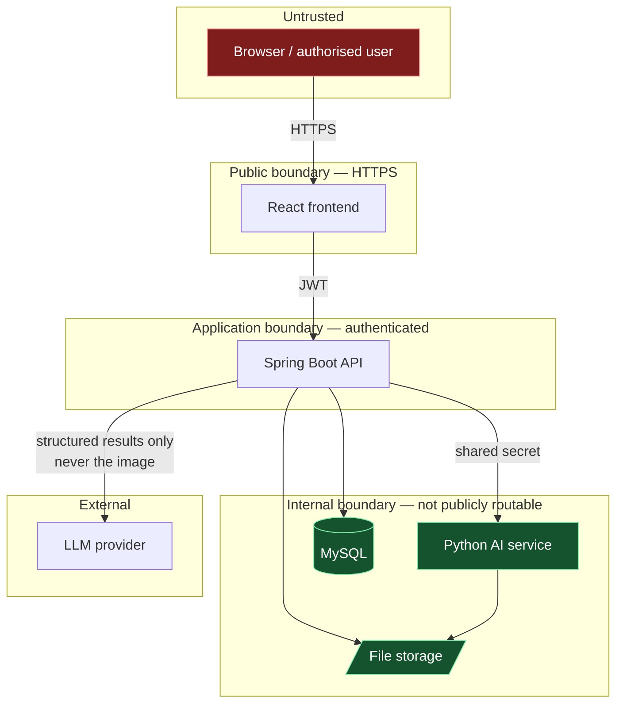

# 01 — System Overview

**Version:** 1.0
**Date:** 2026-08-22

---

## 1. What BrainTwinX is

An **AI-assisted brain MRI analysis platform** for research and clinical decision support. An
authorised user can manage patient records, upload MRI scans, run AI classification and
segmentation, obtain longitudinal trend estimates where enough history exists, and generate
professional PDF reports — with every result traceable to the exact model and preprocessing
version that produced it.

## 2. What BrainTwinX is not

Stated first, because it constrains every design decision that follows.

| Not | Because |
|---|---|
| A diagnostic device | It produces model outputs requiring review by a qualified professional. No regulatory clearance of any kind. |
| A replacement for a radiologist or clinician | Its outputs are decision *support*. The UI, API, and reports keep "AI prediction" and "clinical diagnosis" separate at all times. |
| A source of clinical certainty | Confidence is reported as a model number; trends are labelled *model-based trend estimates*, never predictions of what will happen. |
| Validated for accuracy | No dataset is available, so no model has been trained and **no accuracy figure is claimed anywhere**. |

> **Medical disclaimer.** BrainTwinX provides AI-assisted image analysis for research and
> decision-support purposes. AI-generated results are not a definitive medical diagnosis and
> should not replace evaluation by a qualified healthcare professional.

## 3. Actors

| Actor | Capabilities |
|---|---|
| **ADMIN** | User management, model registry administration, audit-log review |
| **DOCTOR** | Patient management, scan upload, analysis, report generation |
| **RESEARCHER** | Narrower scope aimed at methodological rather than individual-care work; enforced per endpoint, never assumed from the role alone |
| **AI service** (system actor) | Consumes preprocessing output, returns structured inference results. Reachable only on an internal network |
| **LLM provider** (external) | Receives allow-listed *structured* results only — never the image, never free text |

## 4. Functional requirements

| ID | Requirement | Phase |
|---|---|---|
| F-1 | Authenticate with role-based authorisation | 3 |
| F-2 | Create, read, update, and archive patient records | 4 |
| F-3 | Upload MRI scans with hostile-input validation | 5 |
| F-4 | Deterministic, versioned preprocessing | 6 |
| F-5 | Tumour classification with real model confidence | 7 |
| F-6 | Tumour segmentation with mask artefact | 8 |
| F-7 | Longitudinal analysis, refusing insufficient history | 9 |
| F-8 | Grounded explanation that cannot invent findings | 10 |
| F-9 | PDF report generation and authorised download | 11 |
| F-10 | Audit logging of all significant actions | 3–11 |
| F-11 | Asynchronous analysis with status polling | 7 |

## 5. Non-functional requirements

| Category | Requirement | How it is met |
|---|---|---|
| **Medical safety** | A fabricated result must not be *representable* | 14 schema-enforced invariants, verified by test ([05-DATABASE-DESIGN](./05-DATABASE-DESIGN.md) §2) |
| **Reproducibility** | Every result attributable to a model + preprocessing version | Mandatory FK to `model_versions` + `preprocessing_version` column |
| **Security** | Deny by default; least privilege | Explicit authorisation per endpoint; internal AI network; hashed credentials |
| **Privacy** | Minimum viable patient data | No name, contact, address, or free-text history; `birth_year` not full DOB; public-safe `patient_code` in all URLs |
| **Auditability** | Trail cannot be rewritten by application code | Append-only entity; repository declares no delete |
| **Reliability** | Every failure reaches a predictable state | Explicit state machines; mandatory failure codes; stale-job reaper |
| **Testability** | Invariants proven, not asserted in prose | Integration tests against real MySQL, never H2 |
| **Observability** | Correlate a request across services and audit | `trace_id` on audit rows and log lines |
| **Performance** | Model weights loaded once per worker | AI service lifecycle ([ADR-003](../ADR/ADR-003-python-ai-service.md)) |

## 6. System boundaries

**The three boundaries that matter most:**

1. **Upload** — the highest-severity untrusted input. Validated by magic bytes, not the
   client's declared content type; storage keys are server-generated so no user string ever
   reaches a filesystem path.
2. **Internal AI network** — `/internal/ai/**` must never be publicly routable. Defended by
   network placement *and* a shared secret, never by the path prefix alone.
3. **LLM egress** — the provider receives a strongly typed, allow-listed struct. Image bytes
   and free text are *not representable* in that type, which closes the prompt-injection path
   structurally rather than by instruction ([ASSUMPTIONS](../ASSUMPTIONS.md) A-4).

## 7. External dependencies

| Dependency | Purpose | If unavailable |
|---|---|---|
| MySQL 8.0.16+ | Durable state | Application fails to start — deliberate, not degraded |
| File storage | MRI, masks, PDFs | Upload and report generation fail with typed errors |
| Python AI service | Inference | Analysis jobs fail with `AI_SERVICE_UNAVAILABLE`; the rest of the platform works |
| LLM provider | Explanations | **Fails closed** — analysis and reporting still complete; the section reads "Not available" |
| Trained model weights | Real inference | AI service reports **NOT READY**; endpoints return a typed error and **never fabricate a prediction** |

The last two rows are the current state, not hypotheticals — see blockers B-1…B-5 in
[`TASKS.md`](../TASKS.md).

## 8. Current implementation status

| Phase | State |
|---|---|
| P1 Audit & scaffold | ✅ Complete |
| P2 Architecture & database | ✅ Complete — `mvn verify` green, 45 tests |
| P3 Authentication & authorisation | ✅ Complete — `mvn verify` green, 94 tests |
| P4 Patient management | ✅ Complete — `mvn verify` green, 146 tests |
| P5–P16 | ⬜ Not started |

Nothing above is described as working unless a test demonstrates it. Live status:
[`TASKS.md`](../TASKS.md).
