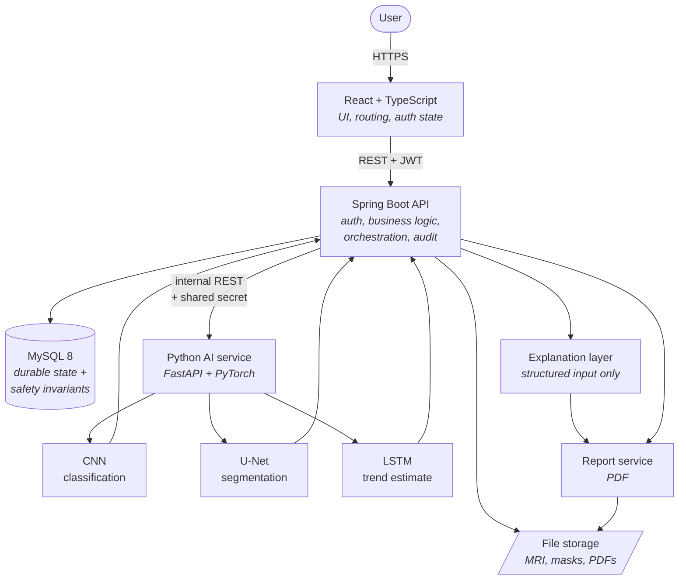
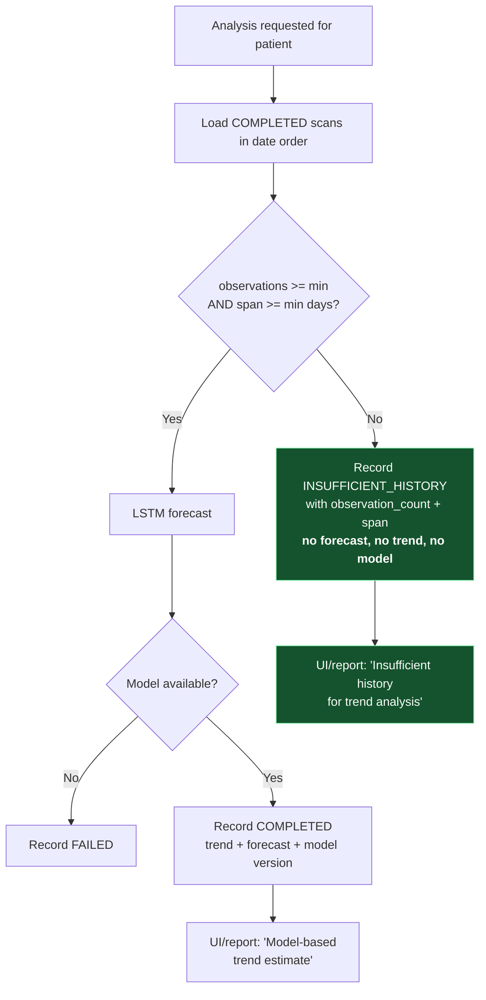
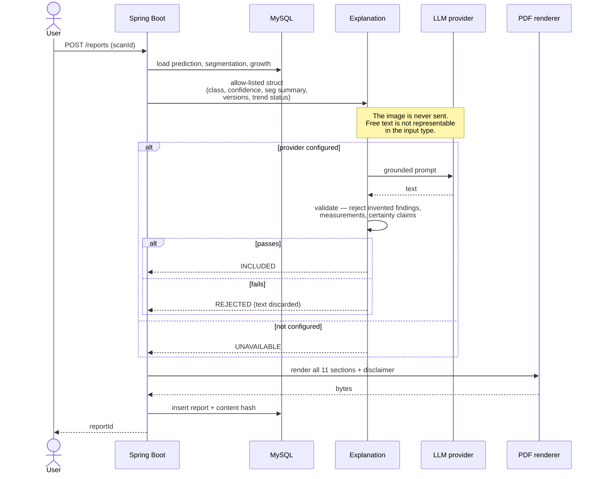
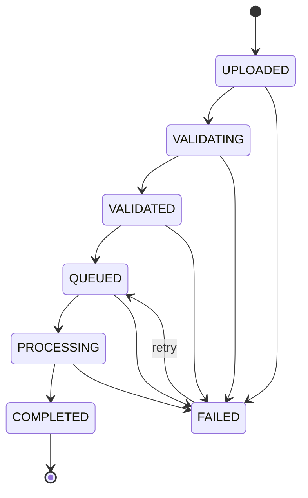
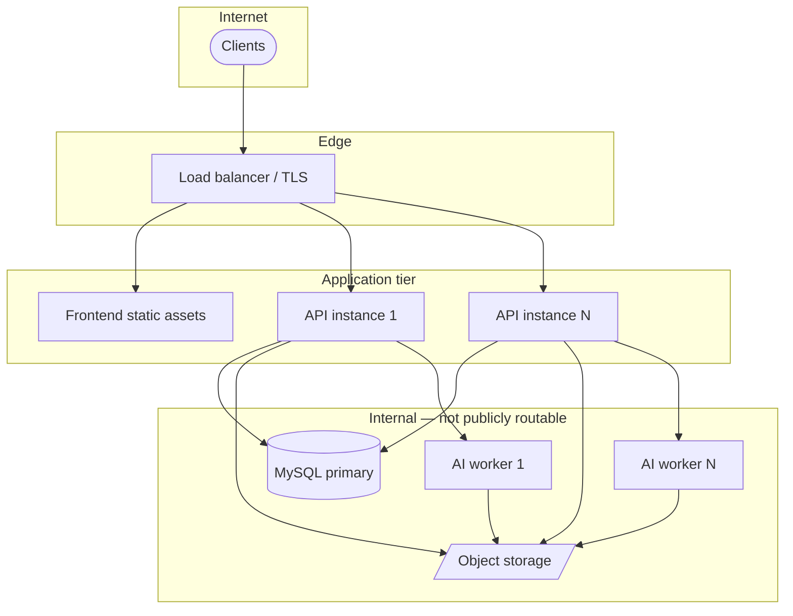

# 02 — High-Level Design

**Version:** 1.0
**Date:** 2026-08-22
**Companion:** [01-SYSTEM-OVERVIEW](./01-SYSTEM-OVERVIEW.md) · [05-DATABASE-DESIGN](./05-DATABASE-DESIGN.md) · [14-ER-DIAGRAM](./14-ER-DIAGRAM.md)

---

## 1. Overall architecture



### Responsibilities

| Component | Owns | Explicitly does **not** own |
|---|---|---|
| **React** | UI, routing, auth state, mask viewer, status polling | Any authorisation decision — hidden UI is usability, never access control |
| **Spring Boot** | Authentication, authorisation, patient/scan lifecycle, AI orchestration, job state, reports, audit | Model execution; preprocessing |
| **Python AI** | Preprocessing, model loading, inference, model health | Job state, persistence, authorisation |
| **MySQL** | Durable state **and enforcement of medical-safety invariants** | Large binaries |
| **File storage** | MRI files, masks, generated PDFs | Any authorisation decision |

The division between Spring Boot and the AI service is the one architectural seam worth
defending: it exists because ML and business logic have genuinely different runtimes, scaling
profiles, and deploy cadences ([ADR-003](../ADR/ADR-003-python-ai-service.md)). It is **not** a
microservice architecture — there are exactly two services and no plans for more.

---

## 2. Authentication flow

```mermaid
sequenceDiagram
    actor User
    participant FE as React
    participant SEC as Spring Security
    participant DB as MySQL
    participant AUD as Audit

    User->>FE: credentials
    FE->>SEC: POST /api/v1/auth/login
    SEC->>DB: load user by username
    DB-->>SEC: user + BCrypt hash
    SEC->>SEC: verify hash; check enabled + not locked
    alt valid
        SEC->>DB: store refresh token HASH only
        SEC->>AUD: LOGIN (success)
        SEC-->>FE: access JWT + refresh token
    else invalid
        SEC->>DB: increment failed_login_attempts
        SEC->>AUD: LOGIN_FAILED (no password in the record)
        SEC-->>FE: 401 — message identical for<br/>unknown user and wrong password
    end
```

Two deliberate details: the failure response is **identical** whether the username exists or
not, so the endpoint is not a user-enumeration oracle; and only a SHA-256 **hash** of the
refresh token is persisted, so a database disclosure yields no usable credential.

---

## 3. MRI analysis flow

```mermaid
sequenceDiagram
    participant FE as React
    participant BE as Spring Boot
    participant DB as MySQL
    participant W as Async worker
    participant AI as AI service

    FE->>BE: POST /scans/{id}/analyze<br/>+ idempotency key
    BE->>DB: existing job for (scan, key)?
    alt already exists
        DB-->>BE: job
        BE-->>FE: 200 — same jobId (no duplicate work)
    else new
        BE->>DB: insert job QUEUED; scan → QUEUED
        BE-->>FE: 202 Accepted + jobId
    end

    W->>DB: claim oldest QUEUED job
    W->>DB: job → RUNNING; scan → PROCESSING
    W->>AI: GET /ready
    alt not ready (no weights)
        AI-->>W: NOT READY
        W->>DB: job FAILED (AI_SERVICE_UNAVAILABLE)<br/>NO prediction row written
    else ready
        W->>AI: POST /predict, /segment
        AI-->>W: class, confidence, probabilities,<br/>model + preprocessing version
        W->>DB: insert prediction + segmentation<br/>(one transaction)
        W->>DB: job SUCCEEDED; scan → COMPLETED
    end

    loop until terminal
        FE->>BE: GET /scans/{id}/status
        BE-->>FE: status + progress
    end
```

**The critical branch is the `not ready` path.** When weights are absent the system fails the
job with a typed error and writes **no** prediction row. There is no code path that substitutes
a value — and because `confidence` is `NOT NULL` with a CHECK, a prediction without genuine
model output is not even representable in the schema.

---

## 4. Longitudinal analysis flow



`INSUFFICIENT_HISTORY` is a first-class recorded outcome, not an error. The
`insufficientHistory()` factory **takes no forecast parameter**, and the database CHECK forbids
one alongside it — so the honest answer is the only representable one. Thresholds are
configuration, not a hard-coded clinical opinion ([ASSUMPTIONS](../ASSUMPTIONS.md) A-5).

---

## 5. Report generation flow



A missing stage renders as **"Not available"**, never as a blank section — an omission could be
misread as a negative clinical finding. The disclaimer is unconditional.

---

## 6. Scan state machine



The graph lives in one place (`ScanStatus`), transitions go only through
`Scan.transitionTo(...)`, and 23 unit tests assert the illegal edges — including that
`COMPLETED` is terminal, so a completed analysis can never be silently revised.

---

## 7. Deployment architecture



Local development collapses this to Docker Compose (Phase 15). API instances are stateless —
job state lives in MySQL — so they scale horizontally without coordination. AI workers scale
independently because inference is CPU/GPU-bound while the API is I/O-bound.

**No message broker.** Job state in MySQL survives restarts and needs no extra operational
component ([ASSUMPTIONS](../ASSUMPTIONS.md) A-9). The queue sits behind an interface so a broker
can be substituted later; the measured trigger will be recorded in `09-SCALABILITY-DESIGN.md`.

---

## 8. Reliability

| Failure | Behaviour |
|---|---|
| Database unavailable | Application refuses to start; running requests fail with typed errors — never degraded silently |
| AI service unavailable / NOT READY | Job → `FAILED` with `AI_SERVICE_UNAVAILABLE`. No prediction written |
| Worker crashes mid-inference | Job stranded in `RUNNING` is recovered by a reaper (`findStaleRunning`) and requeued |
| Duplicate analyse request | Idempotency key resolves to the existing job — enforced by a unique constraint |
| Invalid or corrupt MRI | Scan → `FAILED` with a mandatory failure code |
| LLM unavailable | Explanation `UNAVAILABLE`; analysis and report still complete |
| Report generation failure | Typed error; no partial report row (single transaction) |
| Expired JWT | 401 with a distinguishable code |

Every path ends in a **recorded, predictable state**. The schema makes silent failure
unrepresentable: a `FAILED` scan or job without a failure code is rejected by CHECK constraint.

---

## 9. Verification status

Phase 2 is verified: `mvn verify` **BUILD SUCCESS** — 45 tests (32 unit + 13 integration
against real MySQL 8.4), 0 failures, 0 errors.

Flows in §2–§5 are **designed, not yet implemented** (Phases 3–11). The state machine in §6 and
the schema-level guarantees referenced throughout **are** implemented and tested. Live status:
[`TASKS.md`](../TASKS.md).
