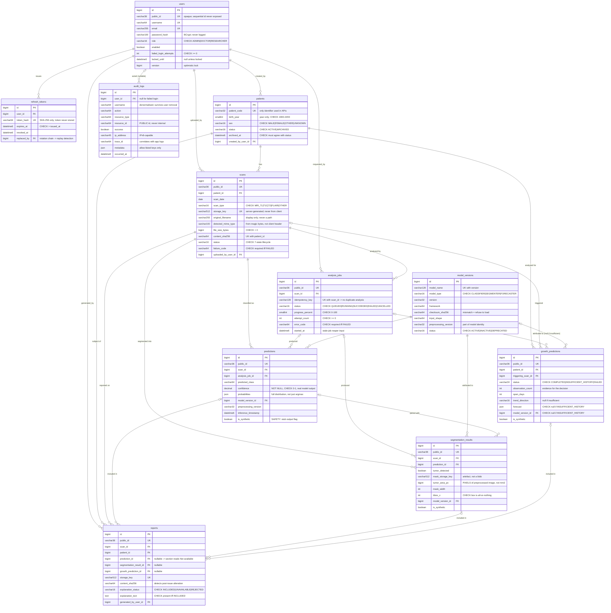

# 14 — Entity Relationship Diagram

**Version:** 1.0
**Date:** 2026-08-22
**Source of truth:** `backend/src/main/resources/db/migration/V1__baseline_schema.sql`

> This diagram documents the **actual** V1 migration, not an idealised model. If the two
> disagree, the migration is correct and this file is stale — fix it.

---

## 1. Diagram

---

## 2. Cardinality notes

| Relationship | Cardinality | Why |
|---|---|---|
| `scans` → `predictions` | 1:N, **not 1:1** | Predictions are append-only. Re-analysis inserts a row so an already-issued report stays explainable by the record behind it. |
| `scans` → `analysis_jobs` | 1:N | A failed job may be retried; each attempt is a distinct row with its own idempotency key. |
| `predictions` → `segmentation_results` | 1:0..N | Segmentation usually accompanies a classification but is independently addressable, since a segmentation model may run without a classifier. |
| `patients` → `growth_predictions` | 1:N | Longitudinal analysis is per patient, not per scan. `triggering_scan_id` records what prompted it. |
| `model_versions` → `growth_predictions` | 0..1:N | **Nullable on purpose.** An `INSUFFICIENT_HISTORY` outcome has no model attribution because no model executed. |
| `users` → `audit_logs` | 0..1:N | Nullable so a failed login against an unknown username is still auditable. |

---

## 3. Referential-action rationale

`ON DELETE` is chosen per relationship rather than uniformly, because "what should happen when
the parent goes away" has different correct answers here.

| Child → Parent | Action | Reason |
|---|---|---|
| `refresh_tokens` → `users` | `CASCADE` | Tokens are worthless without their user and carry no audit value. |
| `patients` → `users` | `RESTRICT` | A user who created patient records cannot be hard-deleted; that would erase provenance. |
| `scans` → `patients` | `RESTRICT` | Patients are soft-archived, never deleted (A-13), so this should never fire. It exists to make a mistaken hard delete fail loudly. |
| `predictions` → `scans` | `CASCADE` | A prediction is meaningless without its scan. |
| `predictions` → `model_versions` | `RESTRICT` | A model version referenced by any result must survive, or the result loses its provenance (§22). |
| `reports` → all results | `RESTRICT` | An issued report must remain reconstructible from its inputs. |
| `audit_logs` → `users` | `SET NULL` | The trail outlives the user; `username` is denormalised to keep it readable. |
| `segmentation_results` → `predictions` | `SET NULL` | The segmentation retains standalone meaning if its paired prediction is removed. |

---

## 4. Indexes and the query patterns that justify them

No index exists speculatively; each maps to a real access path.

| Index | Query it serves |
|---|---|
| `ix_scans_patient_date` | Patient timeline; the ordered series longitudinal analysis consumes |
| `ix_scans_status_created` | Dashboard counts of pending / processing / completed work |
| `ix_analysis_jobs_status_queued` | Worker claiming the oldest queued job (fair drain, no starvation) |
| `uq_analysis_jobs_idempotency` | Idempotency lookup on repeated analyse requests (§21) |
| `uq_scans_patient_content` | Duplicate-upload detection |
| `ix_predictions_scan_created` | Latest prediction for a scan |
| `ix_growth_patient_created` | Latest longitudinal outcome for a patient |
| `ix_reports_patient_created` | Paginated report list per patient |
| `ix_audit_logs_*` (5) | Chronological review, per-user trail, per-action filter, per-resource lookup, trace correlation |

`patients` uses a composite `(status, created_at)` rather than a partial index, since MySQL has
no partial indexes (see [ADR-004](../ADR/ADR-004-mysql.md)).

---

## 5. Verification status

⚠️ **This schema has not yet been applied to a running database.** The migration and the 9
constraint tests in `SchemaMigrationIT` are written but unexecuted — blocked on B-6 in
[`TASKS.md`](../TASKS.md). Treat this document as *designed and reviewed*, not *verified*.
